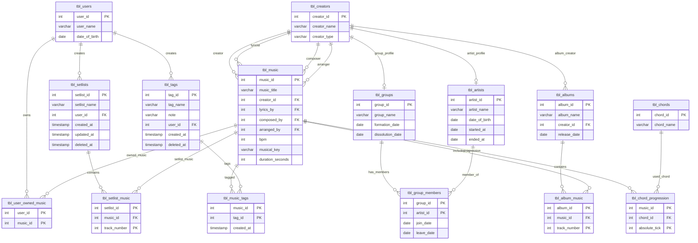

# テーブル定義書
## 基本情報

- システム名：music-app
- RDBMS：PostgreSQL
- 作成日：2026/2/16
- 更新日：2026/3/30

---

## 目次・概要

| NO | 物理名 | 論理名 | 用途 |
| --- | --- | --- | --- |
|  1 | [tbl_users](#tbl_users) | ユーザ管理テーブル | ユーザを管理するテーブル。 |
|  2 | [tbl_creators](#tbl_creators) | クリエイター管理テーブル | クリエイターを管理するテーブル。アーティスト管理テーブルおよびグループ管理テーブルの親テーブル。 |
|  3 | [tbl_artists](#tbl_artists) | アーティスト管理テーブル | 単体のアーティストを管理するテーブル。原則として 1 人のアーティストを前提とする。「tbl_creators」の子テーブル。 |
|  4 | [tbl_groups](#tbl_groups) | グループ管理テーブル | グループを管理するテーブル。原則として「tbl_artists」テーブルの集合であることを前提とする。「tbl_creators」の子テーブル。 |
|  5 | [tbl_music](#tbl_music) | 曲管理テーブル | 曲を管理するテーブル。 |
|  6 | [tbl_albums](#tbl_albums) | アルバム管理テーブル | アルバム（シングル曲、未リリース曲を含む）を管理するテーブル。 |
|  7 | [tbl_album_music](#tbl_album_music) | アルバム収録曲管理テーブル | アルバムに収録されている曲を管理するための、アルバム管理テーブルと曲管理テーブルの中間テーブル。 |
|  8 | [tbl_user_owned_music](#tbl_user_owned_music) | 所有曲管理テーブル | ユーザが所持する曲を管理するための、ユーザ管理テーブルと曲管理テーブルの中間テーブル。 |
|  9 | [tbl_setlists](#tbl_setlists) | セットリスト管理テーブル | セットリストを管理するテーブル。 |
| 10 | [tbl_setlist_music](#tbl_setlist_music) | セットリスト収録曲管理テーブル | セットリストに含まれる曲を管理するための、セットリスト管理テーブルと曲管理テーブルの中間テーブル。 |
| 11 | [tbl_tags](#tbl_tags) | タグ管理テーブル | 音楽ジャンルやサブカルチャーなどのタグを管理するテーブル。 |
| 12 | [tbl_music_tags](#tbl_music_tags) | 曲タグ中間管理テーブル | 曲に付与するタグを管理するための、曲管理テーブルとタグ管理テーブルの中間テーブル。 |
| 13 | [tbl_chords](#tbl_chords) | コード管理テーブル | コードを保存して管理するテーブル。 |
| 14 | [tbl_chord_progression](#tbl_chord_progression) | コード進行管理テーブル | 曲のコード進行を管理するテーブル。 |
| 15 | [tbl_group_members](#tbl_group_members) | グループメンバー中間管理テーブル | 「tbl_artists」テーブルと「tbl_groups」テーブルの中間テーブル。 |

---

## データ項目辞書

| No | 物理名 | 論理名 | PK | FK | カラム名 | 項目名 | 備考 | データ型 |
| --- | --- | --- | --- | --- | --- | --- | --- | --- |
|  1 | tbl_users | ユーザ管理テーブル | ○ |  | user_id | ユーザID |  | INTEGER |
|    |  |  |  |  | user_name | ユーザ名 |  | VARCHAR |
|    |  |  |  |  | date_of_birth | 生年月日 |  | DATE |
|  2 | tbl_creators | クリエイター管理テーブル | ○ |  | creator_id | クリエイターID |  | INTEGER |
|    |  |  |  |  | creator_name | クリエイター名 |  | VARCHAR |
|    |  |  |  |  | creator_type | クリエイター種別 | `SOLO` または `GROUP` | VARCHAR |
|  3 | tbl_artists | アーティスト管理テーブル | ○ | ○ | artist_id | アーティストID | 「tbl_creators」「creator_id」を外部参照キーとする。 | INTEGER |
|    |  |  |  |  | artist_name | アーティスト名 |  | VARCHAR |
|    |  |  |  |  | date_of_birth | 生年月日 |  | DATE |
|    |  |  |  |  | started_at | 活動開始日 |  | DATE |
|    |  |  |  |  | ended_at | 活動終了日 |  | DATE |
|  4 | tbl_groups | グループ管理テーブル | ○ | ○ | group_id | グループID | 「tbl_creators」「creator_id」を外部参照キーとする | INTEGER |
|    |  |  |  |  | group_name | グループ名 |  | VARCHAR |
|    |  |  |  |  | formation_date | 結成日 |  | DATE |
|    |  |  |  |  | dissolution_date | 解散日 |  | DATE |
|  5 | tbl_music | 曲管理テーブル | ○ |  | music_id | 曲ID |  | INTEGER |
|    |  |  |  |  | music_title | 曲名 |  | VARCHAR |
|    |  |  |  | ○ | creator_id | クリエイターID | 「tbl_creators」「creator_id」を外部参照キーとする | INTEGER |
|   |  |  |   | ○ | lyrics_by | 作詞者ID | 「tbl_creators」「creator_id」を外部参照キーとする | INTEGER |
|   |  |  |  | ○ | composed_by | 作曲者ID | 「tbl_creators」「creator_id」を外部参照キーとする | INTEGER |
|   |  |  |  | ○ | arranged_by | 編曲者ID | 「tbl_creators」「creator_id」を外部参照キーとする | INTEGER |
|   |  |  |  |  | bpm | BPM | 20〜400 | INTEGER |
|   |  |  |  |  | musical_key | キー |  | VARCHAR |
|   |  |  |  |  | duration_seconds | 再生時間（秒） | 秒単位で保持する | INTEGER |
|  6 | tbl_albums | アルバム管理テーブル | ○ |  | album_id | アルバムID |  | INTEGER |
|   |  |  |  |  | album_name | アルバム名 |  | VARCHAR |
|   |  |  |  | ○ | creator_id | クリエイターID | 「tbl_creators」「creator_id」を外部参照キーとする | INTEGER |
|   |  |  |  |  | release_date | リリース日 |  | DATE |
|  7 | tbl_album_music | アルバム収録曲管理テーブル | ○ | ○ | album_id | アルバムID | 「tbl_albums」「album_id」を外部参照キーとする | INTEGER |
|   |  |  |  | ○ | music_id | 曲ID | 「tbl_music」「music_id」を外部参照キーとする | INTEGER |
|   |  |  | ○ |  | track_number | 曲順 |  | INTEGER |
|  8 | tbl_user_owned_music | 所有曲管理テーブル | ○ | ○ | user_id | ユーザID | 「tbl_users」「user_id」を外部参照キーとする | INTEGER |
|   |  |  | ○ | ○ | music_id | 曲ID | 「tbl_music」「music_id」を外部参照キーとする | INTEGER |
| 9 | tbl_setlists | セットリスト管理テーブル | ○ |  | setlist_id | セットリストID |  | INTEGER |
|   |  |  |  |  | setlist_name | セットリスト名 |  | VARCHAR |
|   |   |   |   | ○ | user_id | 作成者ID | 「tbl_users」「user_id」を外部参照キーとする | INTEGER |
|   |   |   |   |   | created_at | 作成日時 |  | TIMESTAMP |
|   |   |   |   |   | updated_at | 更新日時 |  | TIMESTAMP |
|   |   |   |   |   | deleted_at | 削除日時 |  | TIMESTAMP |
| 10 | tbl_setlist_music | セットリスト収録曲管理テーブル | ○ | ○ | setlist_id | セットリストID | 「tbl_setlists」「setlist_id」を外部参照キーとする | INTEGER |
|   |   |   |   | ○ | music_id | 曲ID | 「tbl_music」「music_id」を外部参照キーとする | INTEGER |
|   |   |   | ○ |  | track_number | 曲順 |  | INTEGER |
| 11 | tbl_tags | タグ管理テーブル | ○ |  | tag_id | タグID |  | INTEGER |
|   |   |   |   |   | tag_name | タグ名 |  | VARCHAR |
|   |   |   |   |   | note | 備考 |  | VARCHAR |
|   |   |   |   | ○ | user_id | 作成者ID | 「tbl_users」「user_id」を外部参照キーとする | INTEGER |
|   |   |   |   |   | created_at | 作成日時 |  | TIMESTAMP |
|   |   |   |   |   | deleted_at | 削除日時 |  | TIMESTAMP |
| 12 | tbl_music_tags | 曲タグ中間管理テーブル | ○ | ○ | music_id | 曲ID | 「tbl_music」「music_id」を外部参照キーとする | INTEGER |
|   |   |   | ○ | ○ | tag_id | タグID | 「tbl_tags」「tag_id」を外部参照キーとする | INTEGER |
|   |   |   |   |   | created_at | 作成日時 |  | TIMESTAMP |
| 13 | tbl_chords | コード管理テーブル | ○ |  | chord_id | コードID |  | INTEGER |
|   |   |   |   |   | chord_name | コード名 |  | VARCHAR |
| 14 | tbl_chord_progression | コード進行管理テーブル | ○ | ○ | music_id | 曲ID | 「tbl_music」「music_id」を外部参照キーとする | INTEGER |
|   |   |   |   | ○ | chord_id | コードID | 「tbl_chords」「chord_id」を外部参照キーとする | INTEGER |
|   |   |   | ○ |   | absolute_tick | ティック | 1 beat = 480 ticks、1 小節 = 480 × 拍数 | INTEGER |
| 15 | tbl_group_members | グループメンバー中間管理テーブル | ○ | ○ | group_id | グループID | 「tbl_groups」「group_id」を外部参照キーとする | INTEGER |
|   |   |   | ○ | ○ | artist_id | アーティストID | 「tbl_artists」「artist_id」を外部参照キーとする | INTEGER |
|   |   |   |   |   | join_date | 加入日 |  | DATE |
|   |   |   |   |   | leave_date | 脱退日 |  | DATE |

---
## ER図



---


## tbl_users

- 物理名： tbl_users
- 論理名： ユーザ管理テーブル
- 作成日： 2026/2/16
- 更新日： 2026/3/30
- 用途： ユーザを管理するテーブル。

| No | PK | FK | カラム名 | 項目名 | 備考 | データ型 | NOT NULL | 列制約 |
| --- | --- | --- | --- | --- | --- | --- | --- | --- |
| 1 | ○ |  | user_id | ユーザID |  | INTEGER | ○ |  |
| 2 |  |  | user_name | ユーザ名 |  | VARCHAR | ○ |  |
| 3 |  |  | date_of_birth | 生年月日 |  | DATE |  |  |

```SQL
CREATE TABLE tbl_users (
    user_id INTEGER GENERATED BY DEFAULT AS IDENTITY,
    user_name VARCHAR(255) NOT NULL,
    date_of_birth DATE,

    CONSTRAINT pk_users
        PRIMARY KEY (user_id)
);
```

---

## tbl_creators

- 物理名： tbl_creators
- 論理名： クリエイター管理テーブル
- 作成日： 2026/2/16
- 更新日： 2026/3/30
- 用途： クリエイターを管理するテーブル。アーティスト管理テーブルおよびグループ管理テーブルの親となるテーブル。

| No | PK | FK | カラム名 | 項目名 | 備考 | データ型 | NOT NULL | 列制約 |
| --- | --- | --- | --- | --- | --- | --- | --- | --- |
| 1 | ○ |  | creator_id | クリエイターID |  | INTEGER | ○ |  |
| 2 |  |  | creator_name | クリエイター名 |  | VARCHAR | ○ |  |
| 3 |  |  | creator_type | クリエイター種別 | `SOLO` または `GROUP` | VARCHAR |  | CHECK (creator_type IN ('SOLO','GROUP')) |


```SQL
CREATE TABLE tbl_creators (
    creator_id   INTEGER GENERATED BY DEFAULT AS IDENTITY,
    creator_name VARCHAR(255) NOT NULL,
    creator_type VARCHAR(20) CHECK (creator_type IN ('SOLO','GROUP')),

    CONSTRAINT pk_creators
        PRIMARY KEY (creator_id)
);
```

---

## tbl_artists

- 物理名： tbl_artists
- 論理名： アーティスト管理テーブル
- 作成日： 2026/2/16
- 更新日： 2026/3/30
- 用途： 単体のアーティストを管理するテーブル。原則として 1 人のアーティストを前提とし、「tbl_creators」テーブルを親としてもつ。

| No | PK | FK | カラム名 | 項目名 | 備考 | データ型 | NOT NULL | 列制約 |
| --- | --- | --- | --- | --- | --- | --- | --- | --- |
| 1 | ○ | ○ | artist_id | アーティストID | 「tbl_creators」「creator_id」を外部参照キーとする | INTEGER | ○ |  |
| 2 |  |  | artist_name | アーティスト名 |  | VARCHAR | ○ |  |
| 3 |  |  | date_of_birth | 生年月日 |  | DATE |  |  |
| 4 |  |  | started_at | 活動開始日 |  | DATE |  |  |
| 5 |  |  | ended_at | 活動終了日 |  | DATE |  |  |


```SQL
CREATE TABLE tbl_artists (
    artist_id INTEGER NOT NULL,
    artist_name VARCHAR(255) NOT NULL,
    date_of_birth DATE,
    started_at DATE,
    ended_at DATE,

    CONSTRAINT pk_artists
        PRIMARY KEY (artist_id),

    CONSTRAINT fk_artist_creator
        FOREIGN KEY (artist_id)
        REFERENCES tbl_creators(creator_id)
        ON DELETE CASCADE
);
```

---

## tbl_groups

- 物理名： tbl_groups
- 論理名： グループ管理テーブル
- 作成日： 2026/2/16
- 更新日： 2026/3/30
- 用途： グループを管理するテーブル。原則として「tbl_artists」テーブルの集合であることを前提とし、「tbl_creators」テーブルを親としてもつ。

| No | PK | FK | カラム名 | 項目名 | 備考 | データ型 | NOT NULL | 列制約 |
| --- | --- | --- | --- | --- | --- | --- | --- | --- |
| 1 | ○ | ○ | group_id | グループID | 「tbl_creators」「creator_id」を外部参照キーとする | INTEGER | ○ |  |
| 2 |  |  | group_name | グループ名 |  | VARCHAR | ○ |  |
| 3 |  |  | formation_date | 結成日 |  | DATE |  |  |
| 4 |  |  | dissolution_date | 解散日 |  | DATE |  |  |


```sql
CREATE TABLE tbl_groups (
    group_id INTEGER NOT NULL,
    group_name VARCHAR(255) NOT NULL,
    formation_date DATE,
    dissolution_date DATE,

    CONSTRAINT pk_groups
        PRIMARY KEY (group_id),

    CONSTRAINT fk_group_creator
        FOREIGN KEY (group_id)
        REFERENCES tbl_creators(creator_id)
        ON DELETE CASCADE
);
```

---

## tbl_music

- 物理名： tbl_music
- 論理名： 曲管理テーブル
- 作成日： 2026/2/16
- 更新日： 2026/3/30
- 用途： 曲を管理するテーブル。

| No | PK | FK | カラム名 | 項目名 | 備考 | データ型 | NOT NULL | 列制約 |
| --- | --- | --- | --- | --- | --- | --- | --- | --- |
| 1 | ○ |  | music_id | 曲ID |  | INTEGER | ○ |  |
| 2 |  |  | music_title | 曲名 |  | VARCHAR | ○ |  |
| 3 |  | ○ | creator_id | クリエイターID | 「tbl_creators」「creator_id」を外部参照キーとする | INTEGER | ○ |  |
| 4 |  | ○ | lyrics_by | 作詞者ID | 「tbl_creators」「creator_id」を外部参照キーとする | INTEGER |  |  |
| 5 |  | ○ | composed_by | 作曲者ID | 「tbl_creators」「creator_id」を外部参照キーとする | INTEGER |  |  |
| 6 |  | ○ | arranged_by | 編曲者ID | 「tbl_creators」「creator_id」を外部参照キーとする | INTEGER |  |  |
| 7 |  |  | bpm | BPM |  | INTEGER |  | 20〜400 |
| 8 |  |  | musical_key | キー |  | VARCHAR |  |  |
| 9 |  |  | duration_seconds | 再生時間（秒） | 秒単位で保持する | INTEGER |  |  |


```SQL
CREATE TABLE tbl_music (
    music_id INTEGER GENERATED BY DEFAULT AS IDENTITY,
    music_title VARCHAR(255) NOT NULL,
    creator_id INTEGER NOT NULL,
    lyrics_by INTEGER,
    composed_by INTEGER,
    arranged_by INTEGER,
    bpm INTEGER CHECK (bpm BETWEEN 20 AND 400),
    musical_key VARCHAR(5),
    duration_seconds INTEGER,

    CONSTRAINT pk_music
        PRIMARY KEY (music_id),

    CONSTRAINT fk_music_creator
        FOREIGN KEY (creator_id)
        REFERENCES tbl_creators(creator_id),

    CONSTRAINT fk_music_lyrics
        FOREIGN KEY (lyrics_by)
        REFERENCES tbl_creators(creator_id),

    CONSTRAINT fk_music_composed
        FOREIGN KEY (composed_by)
        REFERENCES tbl_creators(creator_id),

    CONSTRAINT fk_music_arranged
        FOREIGN KEY (arranged_by)
        REFERENCES tbl_creators(creator_id)
);
```

---

## tbl_albums

- 物理名： tbl_albums
- 論理名： アルバム管理テーブル
- 作成日： 2026/2/16
- 更新日： 2026/3/30
- 用途： アルバム（シングル曲、未リリース曲を含む）を管理するテーブル。

| No | PK | FK | カラム名 | 項目名 | 備考 | データ型 | NOT NULL | 列制約 |
| --- | --- | --- | --- | --- | --- | --- | --- | --- |
| 1 | ○ |  | album_id | アルバムID |  | INTEGER | ○ |  |
| 2 |  |  | album_name | アルバム名 |  | VARCHAR | ○ |  |
| 3 |  | ○ | creator_id | クリエイターID | 「tbl_creators」「creator_id」を外部参照キーとする | INTEGER | ○ |  |
| 4 |  |  | release_date | リリース日 |  | DATE |  |  |

```SQL
CREATE TABLE tbl_albums (
    album_id   INTEGER GENERATED BY DEFAULT AS IDENTITY,
    album_name VARCHAR(255) NOT NULL,
    creator_id  INTEGER NOT NULL,
    release_date DATE,

    CONSTRAINT pk_albums
        PRIMARY KEY (album_id),

    CONSTRAINT fk_album_creators
        FOREIGN KEY (creator_id)
        REFERENCES tbl_creators(creator_id)
);
```

---

## tbl_album_music

- 物理名： tbl_album_music
- 論理名： アルバム収録曲管理テーブル
- 作成日： 2026/2/16
- 更新日： 2026/3/30
- 用途： アルバムに収録されている曲を管理するための、アルバム管理テーブルと曲管理テーブルの中間テーブル。

| No | PK | FK | カラム名 | 項目名 | 備考 | データ型 | NOT NULL | 列制約 |
| --- | --- | --- | --- | --- | --- | --- | --- | --- |
| 1 | ○ | ○ | album_id | アルバムID | 「tbl_albums」「album_id」を外部参照キーとする | INTEGER | ○ |  |
| 2 |  | ○ | music_id | 曲ID | 「tbl_music」「music_id」を外部参照キーとする | INTEGER | ○ |  |
| 3 | ○ |  | track_number | 曲順 |  | INTEGER | ○ |  |

```SQL
CREATE TABLE tbl_album_music (
    album_id INTEGER NOT NULL,
    music_id INTEGER NOT NULL,
    track_number INTEGER NOT NULL,

    CONSTRAINT pk_album_music
        PRIMARY KEY (album_id,track_number),

    CONSTRAINT fk_am_albums
        FOREIGN KEY (album_id)
        REFERENCES tbl_albums(album_id),

    CONSTRAINT fk_am_music
        FOREIGN KEY (music_id)
        REFERENCES tbl_music(music_id) ON DELETE CASCADE,

    CONSTRAINT uq_album_music
        UNIQUE (album_id,music_id)
);
```

---

## tbl_user_owned_music

- 物理名： tbl_user_owned_music
- 論理名： 所有曲管理テーブル
- 作成日： 2026/2/16
- 更新日： 2026/3/30
- 用途： ユーザが所持する曲を管理するための、ユーザ管理テーブルと曲管理テーブルの中間テーブル。

| No | PK | FK | カラム名 | 項目名 | 備考 | データ型 | NOT NULL | 列制約 |
| --- | --- | --- | --- | --- | --- | --- | --- | --- |
| 1 | ○ | ○ | user_id | ユーザID | 「tbl_users」「user_id」を外部参照キーとする | INTEGER | ○ |  |
| 2 | ○ | ○ | music_id | 曲ID | 「tbl_music」「music_id」を外部参照キーとする | INTEGER | ○ |  |

```SQL
CREATE TABLE tbl_user_owned_music (
    user_id INTEGER NOT NULL,
    music_id INTEGER NOT NULL,

    CONSTRAINT pk_user_owned_music
        PRIMARY KEY (user_id, music_id),

    CONSTRAINT fk_uom_users
        FOREIGN KEY (user_id)
        REFERENCES tbl_users(user_id)
        ON DELETE CASCADE,

    CONSTRAINT fk_uom_music
        FOREIGN KEY (music_id)
        REFERENCES tbl_music(music_id)
        ON DELETE CASCADE
);
```

---

## tbl_setlists

- 物理名： tbl_setlists
- 論理名： セットリスト管理テーブル
- 作成日： 2026/2/16
- 更新日： 2026/3/30
- 用途： セットリストを管理するテーブル。

| No | PK | FK | カラム名 | 項目名 | 備考 | データ型 | NOT NULL | 列制約 |
| --- | --- | --- | --- | --- | --- | --- | --- | --- |
| 1 | ○ |  | setlist_id | セットリストID |  | INTEGER | ○ |  |
| 2 |  |  | setlist_name | セットリスト名 |  | VARCHAR | ○ |  |
| 3 |  | ○ | user_id | 作成者ID | 「tbl_users」「user_id」を外部参照キーとする | INTEGER | ○ |  |
| 4 |  |  | created_at | 作成日時 |  | TIMESTAMP | ○ |  |
| 5 |  |  | updated_at | 更新日時 |  | TIMESTAMP |  |  |
| 6 |  |  | deleted_at | 削除日時 |  | TIMESTAMP |  |  |

```SQL
CREATE TABLE tbl_setlists (
    setlist_id INTEGER GENERATED BY DEFAULT AS IDENTITY,
    setlist_name VARCHAR(255) NOT NULL,
    user_id INTEGER NOT NULL,
    created_at TIMESTAMP DEFAULT CURRENT_TIMESTAMP NOT NULL ,
    deleted_at TIMESTAMP,
    updated_at TIMESTAMP,

    CONSTRAINT pk_setlists
        PRIMARY KEY (setlist_id),

    CONSTRAINT fk_setlist_users
        FOREIGN KEY (user_id)
        REFERENCES tbl_users(user_id)
        ON DELETE CASCADE
);
```

---

## tbl_setlist_music

- 物理名： tbl_setlist_music
- 論理名： セットリスト収録曲管理テーブル
- 作成日： 2026/2/16
- 更新日： 2026/3/30
- 用途： セットリストに含まれる曲を管理するための、セットリスト管理テーブルと曲管理テーブルの中間テーブル。

| No | PK | FK | カラム名 | 項目名 | 備考 | データ型 | NOT NULL | 列制約 |
| --- | --- | --- | --- | --- | --- | --- | --- | --- |
| 1 | ○ | ○ | setlist_id | セットリストID | 「tbl_setlists」「setlist_id」を外部参照キーとする | INTEGER | ○ |  |
| 2 |  | ○ | music_id | 曲ID | 「tbl_music」「music_id」を外部参照キーとする | INTEGER | ○ |  |
| 3 | ○ |  | track_number | 曲順 |  | INTEGER | ○ |  |

```SQL
CREATE TABLE tbl_setlist_music (
    setlist_id INTEGER NOT NULL,
    music_id INTEGER NOT NULL,
    track_number INTEGER NOT NULL,

    CONSTRAINT pk_setlist_music
        PRIMARY KEY (setlist_id,track_number),

    CONSTRAINT fk_sm_setlist
        FOREIGN KEY (setlist_id)
        REFERENCES tbl_setlists(setlist_id),

    CONSTRAINT fk_sm_music
        FOREIGN KEY (music_id)
        REFERENCES tbl_music(music_id) ON DELETE CASCADE
);
```

---

## tbl_tags

- 物理名： tbl_tags
- 論理名： タグ管理テーブル
- 作成日： 2026/2/16
- 更新日： 2026/3/30
- 用途： 音楽ジャンルやサブカルチャーなどのタグを管理するテーブル。


| No | PK | FK | カラム名 | 項目名 | 備考 | データ型 | NOT NULL | 列制約 |
| --- | --- | --- | --- | --- | --- | --- | --- | --- |
| 1 | ○ |  | tag_id | タグID |  | INTEGER | ○ |  |
| 2 |  |  | tag_name | タグ名 |  | VARCHAR | ○ |  |
| 3 |  |  | note | 備考 |  | VARCHAR |  |  |
| 4 |  | ○ | user_id | 作成者ID | 「tbl_users」「user_id」を外部参照キーとする | INTEGER | ○ |  |
| 5 |  |  | created_at | 作成日時 |  | TIMESTAMP | ○ |  |
| 6 |  |  | deleted_at | 削除日時 |  | TIMESTAMP |  |  |

```SQL
CREATE TABLE tbl_tags (
    tag_id INTEGER GENERATED BY DEFAULT AS IDENTITY,
    tag_name VARCHAR(255) NOT NULL,
    note VARCHAR(255),
    user_id INTEGER NOT NULL,
    created_at TIMESTAMP DEFAULT CURRENT_TIMESTAMP NOT NULL,
    deleted_at TIMESTAMP,

    CONSTRAINT pk_tags
        PRIMARY KEY (tag_id),

    CONSTRAINT fk_tag_users
        FOREIGN KEY (user_id)
        REFERENCES tbl_users(user_id),

    CONSTRAINT uq_tags_name
        UNIQUE (tag_name,user_id)
);
```

---

## tbl_music_tags

- 物理名： tbl_music_tags
- 論理名： 曲タグ中間管理テーブル
- 作成日： 2026/2/16
- 更新日： 2026/3/30
- 用途： 曲に付与するタグを管理するための、曲管理テーブルとタグ管理テーブルの中間テーブル。

| No | PK | FK | カラム名 | 項目名 | 備考 | データ型 | NOT NULL | 列制約 |
| --- | --- | --- | --- | --- | --- | --- | --- | --- |
| 1 | ○ | ○ | music_id | 曲ID | 「tbl_music」「music_id」を外部参照キーとする | INTEGER | ○ |  |
| 2 | ○ | ○ | tag_id | タグID | 「tbl_tags」「tag_id」を外部参照キーとする | INTEGER | ○ |  |
| 3 |  |  | created_at | 作成日時 |  | TIMESTAMP | ○ |  |

```SQL
CREATE TABLE tbl_music_tags (
    music_id INTEGER NOT NULL,
    tag_id INTEGER NOT NULL,
    created_at TIMESTAMP DEFAULT CURRENT_TIMESTAMP NOT NULL,

    CONSTRAINT pk_music_tags
        PRIMARY KEY (music_id, tag_id),

    CONSTRAINT fk_mt_music
        FOREIGN KEY (music_id)
        REFERENCES tbl_music(music_id)
        ON DELETE CASCADE,

    CONSTRAINT fk_mt_tag
        FOREIGN KEY (tag_id)
        REFERENCES tbl_tags(tag_id)
        ON DELETE CASCADE
);
```

---

## tbl_chords

- 物理名： tbl_chords
- 論理名： コード管理テーブル
- 作成日： 2026/2/16
- 更新日： 2026/3/30
- 用途： コードを保存して管理するテーブル。


| No | PK | FK | カラム名 | 項目名 | 備考 | データ型 | NOT NULL | 列制約 |
| --- | --- | --- | --- | --- | --- | --- | --- | --- |
| 1 | ○ |  | chord_id | コードID |  | INTEGER | ○ |  |
| 2 |  |  | chord_name | コード名 |  | VARCHAR | ○ | ユニーク |

```SQL
CREATE TABLE tbl_chords (
    chord_id INTEGER GENERATED BY DEFAULT AS IDENTITY,
    chord_name VARCHAR(20) NOT NULL,

    CONSTRAINT pk_chords
        PRIMARY KEY (chord_id),

    CONSTRAINT uq_chords_name
        UNIQUE (chord_name)
);
```

---

## tbl_chord_progression

- 物理名： tbl_chord_progression
- 論理名： コード進行管理テーブル
- 作成日： 2026/2/16
- 更新日： 2026/3/30
- 用途： 曲のコード進行を管理するテーブル。


| No | PK | FK | カラム名 | 項目名 | 備考 | データ型 | NOT NULL | 列制約 |
| --- | --- | --- | --- | --- | --- | --- | --- | --- |
| 1 | ○ | ○ | music_id | 曲ID | 「tbl_music」「music_id」を外部参照キーとする | INTEGER | ○ |  |
| 2 |  | ○ | chord_id | コードID | 「tbl_chords」「chord_id」を外部参照キーとする | INTEGER | ○ |  |
| 3 | ○ |  | absolute_tick | ティック | 1 beat = 480 ticks、1 小節 = 480 × 拍数 | INTEGER | ○ |  |

```SQL
CREATE TABLE tbl_chord_progression (
    music_id INTEGER NOT NULL,
    chord_id INTEGER NOT NULL,
    absolute_tick INTEGER NOT NULL,

    CONSTRAINT pk_chord_progression
        PRIMARY KEY (music_id, absolute_tick),

    CONSTRAINT fk_cp_music
        FOREIGN KEY (music_id)
        REFERENCES tbl_music(music_id)
        ON DELETE CASCADE,

    CONSTRAINT fk_cp_chord
        FOREIGN KEY (chord_id)
        REFERENCES tbl_chords(chord_id)
);
```

---

## tbl_group_members

- 物理名： tbl_group_members
- 論理名： グループメンバー中間管理テーブル
- 作成日： 2026/2/16
- 更新日： 2026/3/30
- 用途： 「tbl_artists」テーブルと「tbl_groups」テーブルの中間テーブル。


| No | PK | FK | カラム名 | 項目名 | 備考 | データ型 | NOT NULL | 列制約 |
| --- | --- | --- | --- | --- | --- | --- | --- | --- |
| 1 | ○ | ○ | group_id | グループID | 「tbl_groups」「group_id」を外部参照キーとする | INTEGER | ○ |  |
| 2 | ○ | ○ | artist_id | アーティストID | 「tbl_artists」「artist_id」を外部参照キーとする | INTEGER | ○ |  |
| 3 |  |  | join_date | 加入日 |  | DATE |  |  |
| 4 |  |  | leave_date | 脱退日 |  | DATE |  |  |

```SQL
CREATE TABLE tbl_group_members (
    group_id  INTEGER NOT NULL,
    artist_id INTEGER NOT NULL,
    join_date DATE,
    leave_date DATE,

    CONSTRAINT pk_group_members
        PRIMARY KEY (group_id, artist_id),

    CONSTRAINT fk_gm_group
        FOREIGN KEY (group_id)
        REFERENCES tbl_groups(group_id)
        ON DELETE CASCADE,

    CONSTRAINT fk_gm_artist
        FOREIGN KEY (artist_id)
        REFERENCES tbl_artists(artist_id)
        ON DELETE CASCADE
);
```
